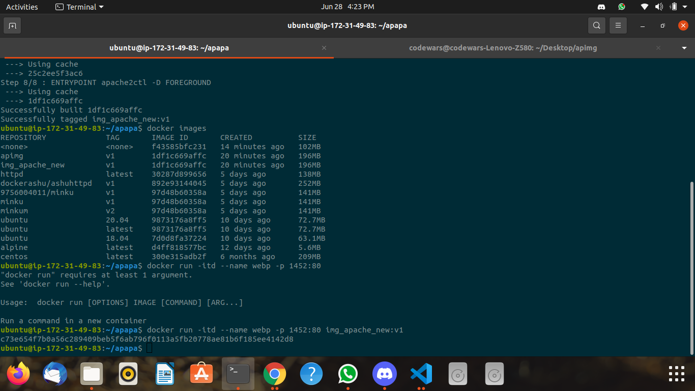
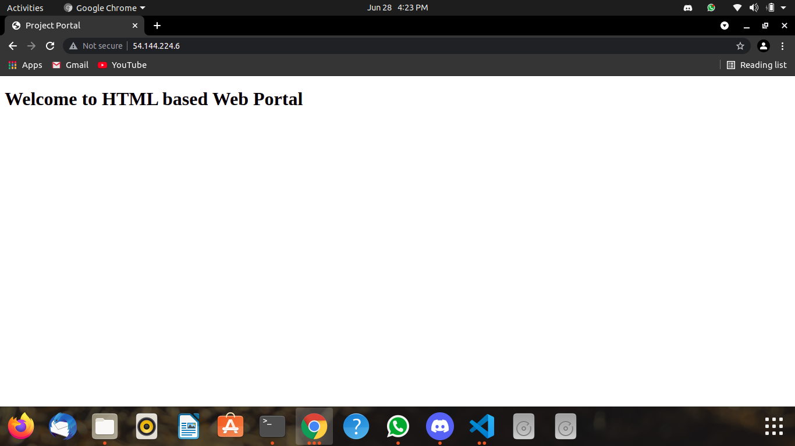

## DockerFile for apacheImage ##


```
FROM ubuntu:18.04
# MAINTAINER minku1219@gmail.com
RUN apt update -y
RUN apt install apache2 -y && apt clean
WORKDIR /var/www/html/
ADD index.html /var/www/html/index.html
EXPOSE 80
#CMD apache2ctl -D FOREGROUND
# CMD apache2 -k start
ENTRYPOINT apache2ctl -D FOREGROUND
```


## HTML File ##


```
<html>
    <head>
        <title>Example</title>
    </head>
    <body>
        <p>This is an example of a simple HTML page with one paragraph.</p>
    </body>
</html>
```


## Commands For Building a Image and Running it ##


```
docker build -t image_name:tag .
docker run -itd --name container_name -p port:port image_name
```


## ScreenShot ##








