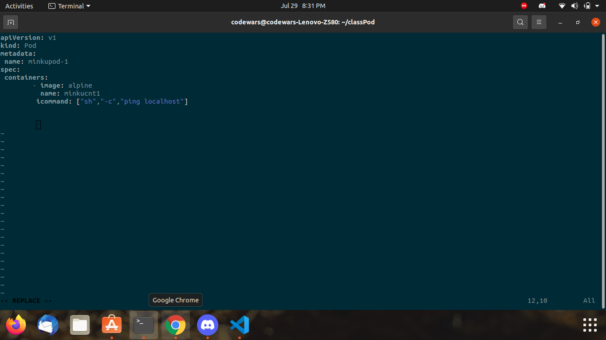
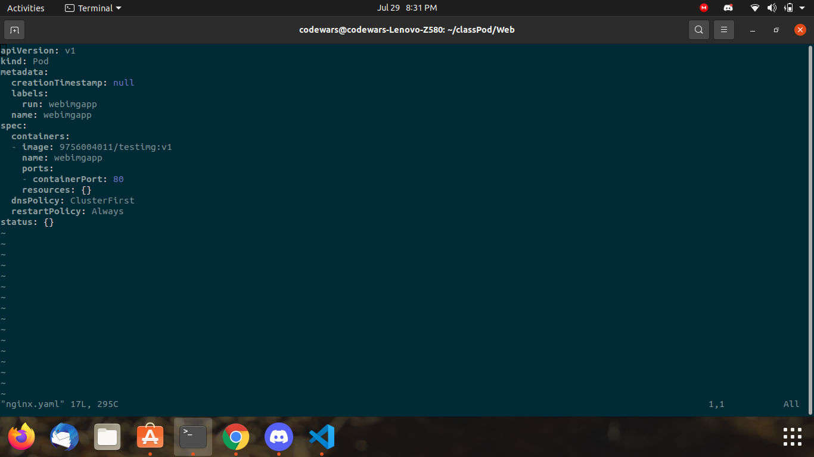

## Installing minikube 


```
curl -LO https://storage.googleapis.com/minikube/releases/latest/minikube-linux-amd64
sudo install minikube-linux-amd64 /usr/local/bin/minikube
```


## Version Check for minikube


```
minikube version
```


## Start minikube 


```
minikube  start --driver=docker
```


## Install kubectl


```
curl -LO "https://dl.k8s.io/release/$(curl -L -s https://dl.k8s.io/release/stable.txt)/bin/linux/amd64/kubectl"
echo "$(<kubectl.sha256) kubectl" | sha256sum --check
sudo install -o root -g root -m 0755 kubectl /usr/local/bin/kubectl
```


## kubectl version check


```
kubectl version --client
```


## kubectl node check


```
kubectl   get  nodes
```


## YAML File for Creating Pods


```
apiVersion: v1
kind: Pod
metadata: 
 name: minkupod-1
spec: 
 containers:
        - image: alpine
          name: minkucnt1
          command: ["sh","-c","ping localhost"]
```


## Checking YAML File Using Dry Run


```
kubectl apply -f pod1.yaml --dry-run=client
```


## Creating Pod


```
kubectl apply -f pod1.yaml
kubectl get pods
```


## Output Of Pod


```
kubectl logs -f pod_name
```


## Building Pod Using Docker Image


Dry Run
```
kubectl run pod_name --image=image_name --dry-run=client
```

Making Pod
```
kubectl run pod_name --image=image_name
```


## Basic Pod Commands


Get Bash of Pod
```
kubectl exec -it minkupypod1 -- bash
```

Get Pod Description
```
kubectl describe pod pod_name
```


## Build Pod With Port 


Dry Run
```
kubectl run pod_name --image=image_name --port 80 --dry-run=client
```

Building Pod
```
kubectl run pod_name --image=image_name --port 80
```


## Creating YAML File Directly From Pod Dry Run


```
 kubectl run pod_name --image=image_name --port 80 --dry-run=client -o yaml >nginx.yaml
 ```
 
 Build Pod Using YAML File Created From pod Dry Run
 ```
 kubectl apply -f YAML_FileName
 ```
 
 
 
## Exposing Pod


```
kubectl expose pod pod_name --type NodePort --port 80
kubectl get service
```


## Generating MiniKube URL


```
minikube service --url pod_name
```


## ScreenShot for Kubernetes


## ScreenShots of YAML File Self-Created





##ScreenShots of YAML File Generated Using Dry Run





