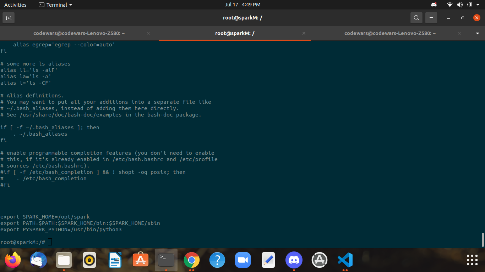

## Create a Common Image ##


```
docker run -it  --name spark_common  ubuntu bash
```


## Setting Up Image With All Requirements Of Spark ##


```
apt update
apt  install  default-jdk  git  scala -y 
java -version ; javac -version ; scala -version ; git --version 
apt install wget -y
wget  https://downloads.apache.org/spark/spark-3.1.2/spark-3.1.2-bin-hadoop3.2.tgz
tar xvzf  spark-3.1.2-bin-hadoop3.2.tgz 
rm  spark-3.1.2-bin-hadoop3.2.tgz 
mv  spark-3.1.2-bin-hadoop3.2/  /opt/spark 
apt install vim -y
apt install python3 -y
apt install net-tools -y
```


## Set /root/.bashrc File ##


```
export SPARK_HOME=/opt/spark
export PATH=$PATH:$SPARK_HOME/bin:$SPARK_HOME/sbin
export PYSPARK_PYTHON=/usr/bin/python3
```


## Create a Common Image For Making Containers Using It ##


```
docker  commit  -m  "spark common image"   spark_com   spark:v1 
```


## Pushed Docker Image Name ##


9756004011/spark:v1
```
docker pull 9756004011/spark:v1
```


## Spark Conatainer Creation ##


```
docker  run -itd  --name sparkMaster --hostname sparkM  --network Hadoop_Br  -p 9898:8080 --restart  always  9756004011/spark:v1 bash
```


## Start Spark Workspace and Master ##


```
start-master.sh
start-worker.sh spark://sparkM:7077
jps
```


## Basic Commands to Use in Pyspark ##


```
sc.PACKAGE_EXTENSIONS    sc.defaultMinPartitions  sc.master                sc.sequenceFile(         sc.startTime
sc.accumulator(          sc.defaultParallelism    sc.newAPIHadoopFile(     sc.serializer            sc.statusTracker(
sc.addFile(              sc.dump_profiles(        sc.newAPIHadoopRDD(      sc.setCheckpointDir(     sc.stop(
sc.addPyFile(            sc.emptyRDD(             sc.parallelize(          sc.setJobDescription(    sc.textFile(
sc.appName               sc.environment           sc.pickleFile(           sc.setJobGroup(          sc.uiWebUrl
sc.applicationId         sc.getCheckpointDir(     sc.profiler_collector    sc.setLocalProperty(     sc.union(
sc.binaryFiles(          sc.getConf(              sc.pythonExec            sc.setLogLevel(          sc.version
sc.binaryRecords(        sc.getLocalProperty(     sc.pythonVer             sc.setSystemProperty(    sc.wholeTextFiles(
sc.broadcast(            sc.getOrCreate(          sc.range(                sc.show_profiles(        
sc.cancelAllJobs(        sc.hadoopFile(           sc.resources             sc.sparkHome             
sc.cancelJobGroup(       sc.hadoopRDD(            sc.runJob(               sc.sparkUser(   
```


## Create and Process Data Using Pyspark ##


```
yes "Data" >File_location
f1=sc.textFile(File_location)
f1.first()
```


## ScreenShot For /root/.bashrc File ##





