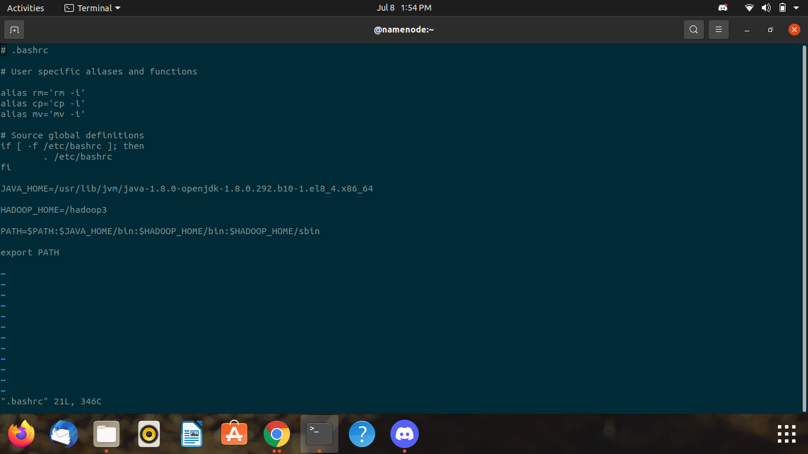
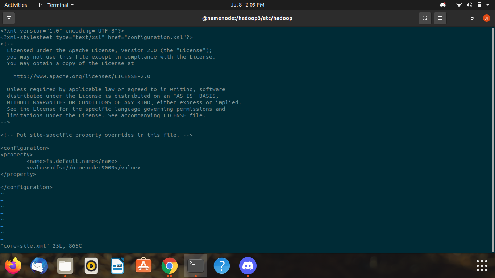
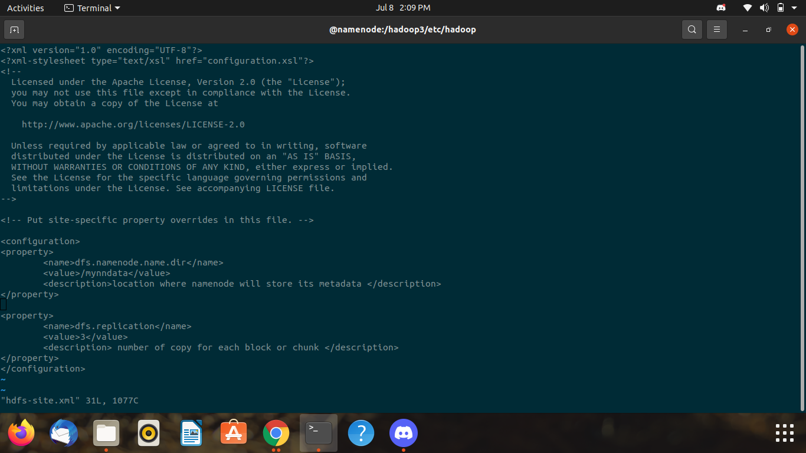

## Steps to Create a Network/Switch ##


```
docker network create network_name --subnet ip_series
docker network ceate myhadoop_br --subnet 172.31.49.84/24
```


## Create Containers ##


```
docker  run  -itd --name  namenode  --hostname namenode --network myhadoop_br --ip 172.31.49.1 oraclelinux:8.3  bash  
docker  run  -itd --name  datanode1  --hostname datanode1 --network myhadoop_br  oraclelinux:8.3  bash 
docker  run  -itd --name  datanode2  --hostname datanode2 --network myhadoop_br  oraclelinux:8.3  bash 
``` 


## Install Java on Container ##


```
dnf  install  java-1.8.0-openjdk.x86_64  java-1.8.0-openjdk-devel.x86_64 -y
``` 


## Set Path of Java in Linux .bashrc File ##


Go to .bashrc File
```
cd ~
vi .bashrc
```
Check Java Version
```
java -version
```
Add This to your .bashrc file 
```
JAVA_HOME=/usr/lib/jvm/java-1.8.0-openjdk-1.8.0.292.b10-1.el8_4.x86_64
PATH=$PATH:$JAVA_HOME/bin
export PATH
```


## Install Hadoop ##


```
wget https://downloads.apache.org/hadoop/common/stable/hadoop-3.3.1.tar.gz
```


## Transfer Hadoop to Containers ##


```
docker cp hadoop-3.3.1.tar.gz namenode:/
docker cp hadoop-3.3.1.tar.gz datanode1:/
docker cp hadoop-3.3.1.tar.gz datanode2:/
```


## Unzip and Install Hadoop File ##


```
dnf install tar -y
tar -xvf hadoop-3.3.1.tar.gz
```


## Create an image Using Existing Docker Containers ##


```
docker commit -m "datanode sample" datanode1 hadoop:v1
```


## Setting Path Of Hadoop_Cluster ##


```
JAVA_HOME=/usr/lib/jvm/java-1.8.0-openjdk-1.8.0.292.b10-1.el8_4.x86_64

HADOOP_HOME=/hadoop3

PATH=$PATH:$JAVA_HOME/bin:$HADOOP_HOME/bin:$HADOOP_HOME/sbin

export PATH
```


## Setting Hadoop_Cluster Steps ##


```
rm hadoop-3.3.1.tar.gz
mv hadoop-3.3.1/ hadoop3
cd hadoop3/etc/hadoop/
vi hadoop-env.sh
vi core-site.xml 
vi hdfs-site.xml
```

Make Desirable Changes in hadoop-env.sh
```
export JAVA_HOME=/usr/lib/jvm/java-1.8.0-openjdk-1.8.0.292.b10-1.el8_4.x86_64
export HADOOP_HOME=/hadoop3
```

Make Desirable Changes in core-site.xml 
```
<configuration>
<property>
        <name>fs.default.name</name>
        <value>hdfs://namenode:9000</value>
</property>

</configuration>
```

Make Desirable Changes in hdfs-site.xml
```
<configuration>
<property>
        <name>dfs.namenode.name.dir</name>
        <value>/mynndata</value>
        <description>location where namenode will store its metadata </description>
</property>

<property>
        <name>dfs.replication</name>
        <value>3</value>
        <description> number of copy for each block or chunk </description>
</property>
</configuration>
```


## Turning on Hadoop_clusters DataNode ##


```
hdfs namenode -format
hdfs --daemon start namenode
jps
```


## .bashrc File ScreenShot for Java Path ##


## Path ScreenShot ##


## .bashrc File ScreenShot for Hadoop_Cluster Path ##





## hadoop-env.sh File ScreenShot ##


## core-site.xml File ScreenShot ##





## hdfs-site.xml File ScreenShot ##





