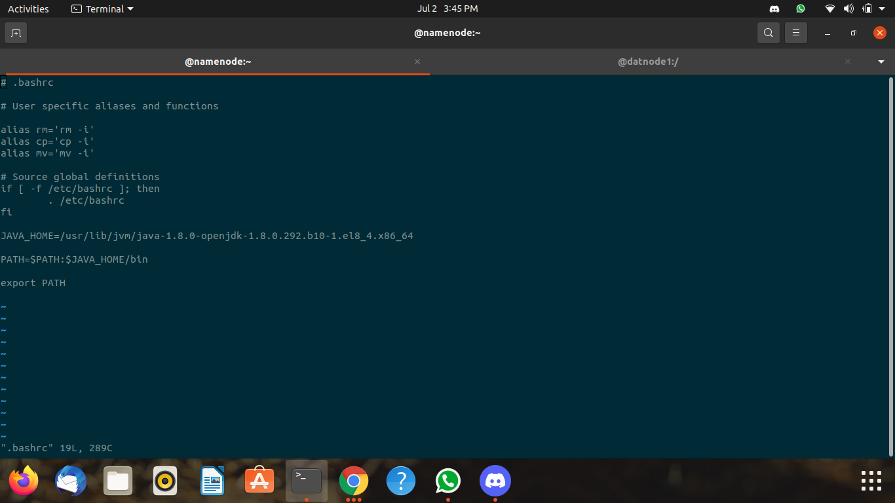
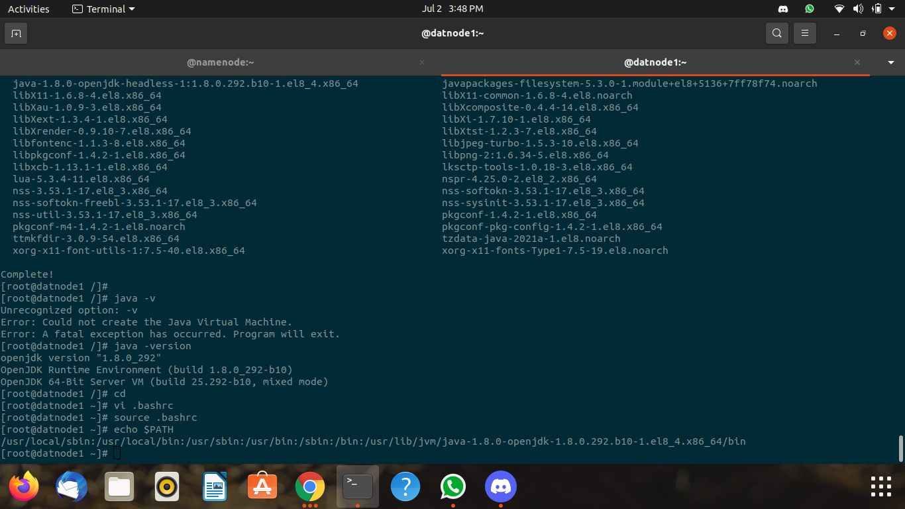

## Steps to Create a Network/Switch ##


```
docker network create network_name --subnet ip_series
docker network ceate myhadoop_br --subnet 172.31.49.84/24
```


## Create Containers ##


```
docker  run  -itd --name  namenode  --hostname namenode --network myhadoop_br --ip 172.31.49.1 oraclelinux:8.3  bash  
docker  run  -itd --name  datanode1  --hostname datanode1 --network myhadoop_br  oraclelinux:8.3  bash 
docker  run  -itd --name  datanode2  --hostname datanode2 --network myhadoop_br  oraclelinux:8.3  bash 
``` 


## Install Java on Container ##


```
dnf  install  java-1.8.0-openjdk.x86_64  java-1.8.0-openjdk-devel.x86_64 -y
``` 


## Set Path of Java in Linux .bashrc File ##


Go to .bashrc File
```
cd ~
vi .bashrc
```


Add This to your .bashrc file 
```
JAVA_HOME=/usr/lib/jvm/java-1.8.0-openjdk-1.8.0.292.b10-1.el8_4.x86_64
PATH=$PATH:$JAVA_HOME/bin
export PATH
```


## Install Hadoop ##


```
https://downloads.apache.org/hadoop/common/stable/hadoop-3.3.1.tar.gz
```


## .bashrc File ScreenShot ##





## Path ScreenShot ##



