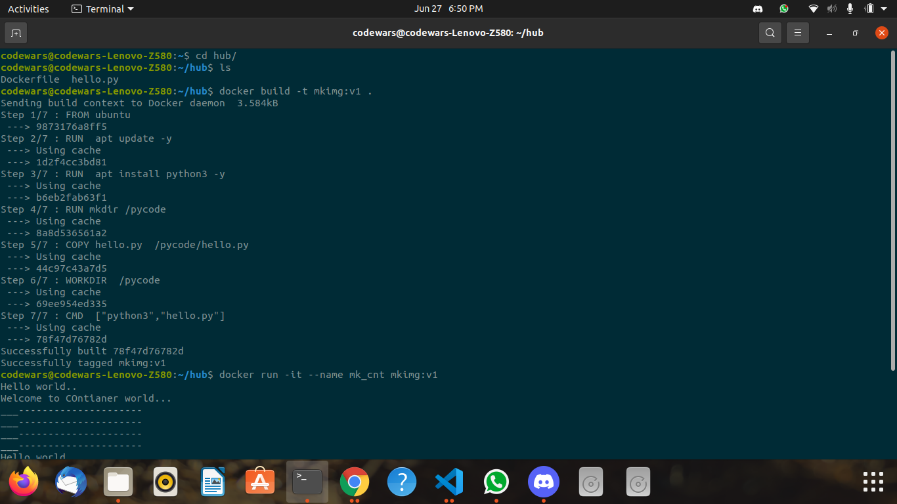

## Docker File


```
FROM ubuntu
# this image will be pulled from docker hub if not present
# MAINTAINER  minku@gmail.com
# optional field but good to write 
RUN  apt update -y
RUN  apt install python3 -y
# RUN instruction is for getting shell during image build time
RUN mkdir /pycode
# creating a directory to put  my code inside docker image 
COPY hello.py  /pycode/hello.py
# to copy data from client location to docker image 
# make sure your code location is same as Dockerfile location
WORKDIR  /pycode
# changing location of docker image like cd command in linux
CMD  ["python3","hello.py"]
# to set default process for container 
```


## hello.py Python File


```
import time

while 2 > 1:
    print("Hello world..")
    time.sleep(1)
    print("Welcome to COntianer world...")
    time.sleep(2)
    print("___---------------------")
    print("___---------------------")
    print("___---------------------")
    print("___---------------------")
```


## ScreenShot ##





