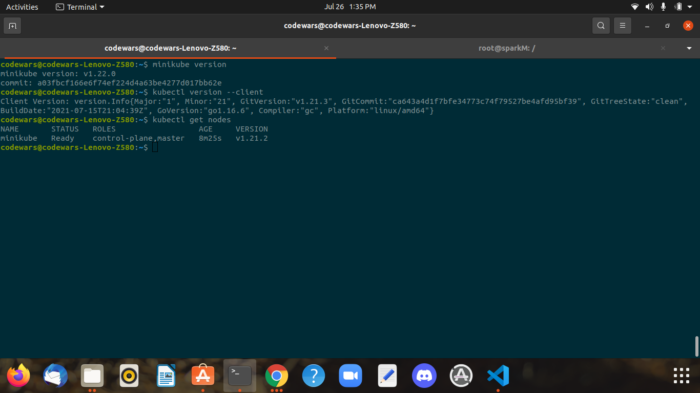

## Installing minikube 


```
curl -LO https://storage.googleapis.com/minikube/releases/latest/minikube-linux-amd64
sudo install minikube-linux-amd64 /usr/local/bin/minikube
```


## Version Check for minikube


```
minikube version
```


## Start minikube 


```
minikube  start --driver=docker
```


## Install kubectl


```
curl -LO "https://dl.k8s.io/release/$(curl -L -s https://dl.k8s.io/release/stable.txt)/bin/linux/amd64/kubectl"
echo "$(<kubectl.sha256) kubectl" | sha256sum --check
sudo install -o root -g root -m 0755 kubectl /usr/local/bin/kubectl
```


## kubectl version check


```
kubectl version --client
```


## kubectl node check


```
kubectl   get  nodes
```


## ScreenShot for Kubernetes





