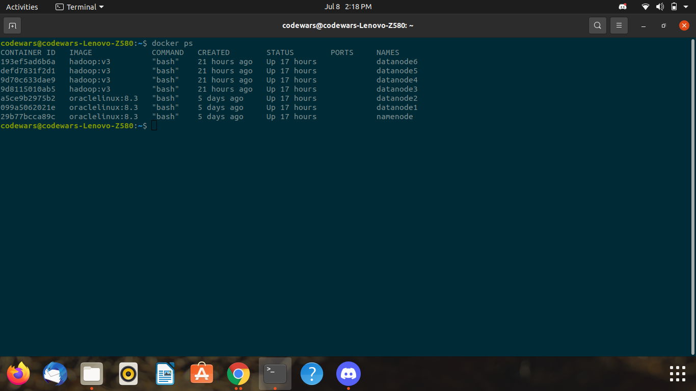
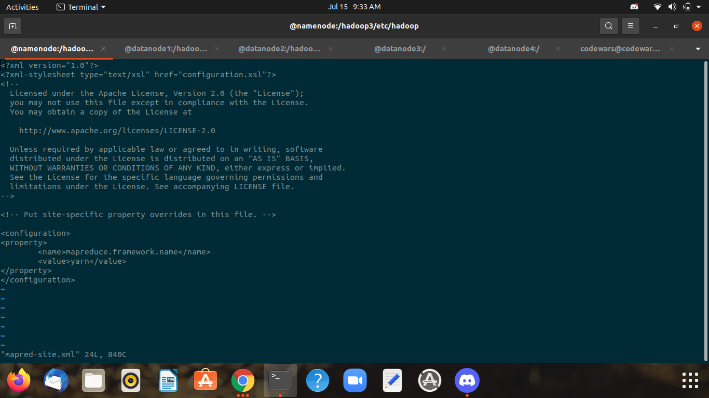
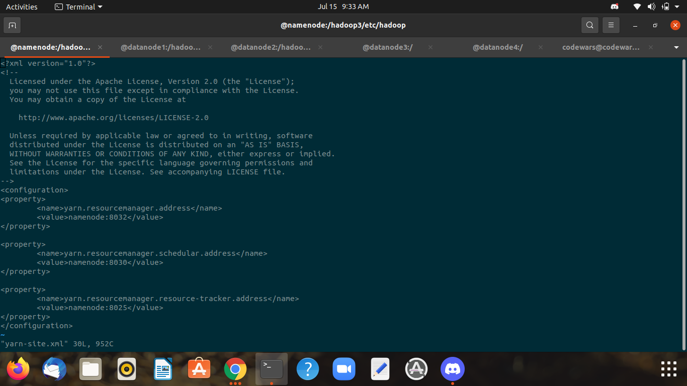
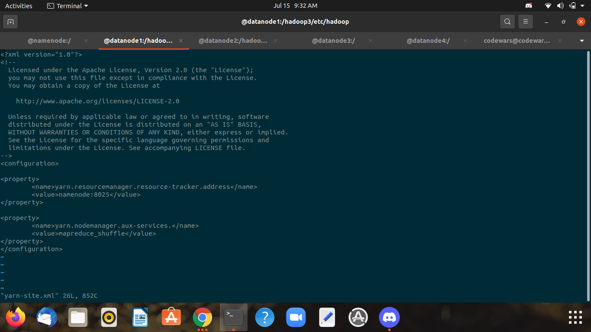

## Steps to Create a Network/Switch ##


```
docker network create network_name --subnet ip_series
docker network ceate myhadoop_br --subnet 192.168.200.100/24
```


## Create Containers ##


```
docker  run  -itd --name  namenode  --hostname namenode --network myhadoop_br --ip 198.168.200.100 oraclelinux:8.3  bash  
docker  run  -itd --name  datanode1  --hostname datanode1 --network myhadoop_br  oraclelinux:8.3  bash 
docker  run  -itd --name  datanode2  --hostname datanode2 --network myhadoop_br  oraclelinux:8.3  bash 
``` 


## Install Java on Container ##


```
dnf  install  java-1.8.0-openjdk.x86_64  java-1.8.0-openjdk-devel.x86_64 -y
``` 


## Set Path of Java in Linux .bashrc File ##


Go to .bashrc File
```
cd ~
vi .bashrc
```
Check Java Version
```
java -version
```
Add This to your .bashrc file 
```
JAVA_HOME=/usr/lib/jvm/java-1.8.0-openjdk-1.8.0.292.b10-1.el8_4.x86_64
PATH=$PATH:$JAVA_HOME/bin
export PATH
```


## Install Hadoop ##


```
wget https://downloads.apache.org/hadoop/common/stable/hadoop-3.3.1.tar.gz
```


## Transfer Hadoop to Containers ##


```
docker cp hadoop-3.3.1.tar.gz namenode:/
docker cp hadoop-3.3.1.tar.gz datanode1:/
docker cp hadoop-3.3.1.tar.gz datanode2:/
```


## Unzip and Install Hadoop File ##


```
dnf install tar -y
tar -xvf hadoop-3.3.1.tar.gz
```


## Create an image Using Existing Docker Containers ##


```
docker commit -m "datanode sample" datanode1 hadoop:v1
docker  run  -itd --name  datanode2  --hostname datanode2 --network Hadoop_Br hadoop:v1  bash  
docker  run  -itd --name  datanode3  --hostname datanode3 --network Hadoop_Br  hadoop:v1  bash 
docker  run  -itd --name  datanode4  --hostname datanode4 --network Hadoop_Br  hadoop:v1  bash 

```


## Setting Path Of Hadoop_Cluster  For NameNode And DataNode##


```
JAVA_HOME=/usr/lib/jvm/java-1.8.0-openjdk-1.8.0.292.b10-1.el8_4.x86_64

HADOOP_HOME=/hadoop3

PATH=$PATH:$JAVA_HOME/bin:$HADOOP_HOME/bin:$HADOOP_HOME/sbin

export PATH
```


## Setting Hadoop_Cluster Steps ##


```
rm hadoop-3.3.1.tar.gz
mv hadoop-3.3.1 /hadoop3
cd hadoop3/etc/hadoop/
vi hadoop-env.sh
vi core-site.xml 
vi hdfs-site.xml
```

Make Desirable Changes in hadoop-env.sh Same for Both
```
export JAVA_HOME=/usr/lib/jvm/java-1.8.0-openjdk-1.8.0.292.b10-1.el8_4.x86_64
export HADOOP_HOME=/hadoop3
```

Make Desirable Changes in core-site.xml Same for Both
```
<configuration>
<property>
        <name>fs.default.name</name>
        <value>hdfs://namenode:9000</value>
</property>

</configuration>
```

Make Desirable Changes in hdfs-site.xml only for NameNode
```
<configuration>
<property>
        <name>dfs.namenode.name.dir</name>
        <value>/mynndata</value>
        <description>location where namenode will store its metadata </description>
</property>

<property>
        <name>dfs.replication</name>
        <value>3</value>
        <description> number of copy for each block or chunk </description>
</property>
</configuration>
```

Make Desirable Changes in hdfs-site.xml only for DataNode
```
<configuration>

<property>
        <name>dfs.datanode.data.dir</name>
        <value>/mydndata1</value>
        <description>location where datanode will store its data</description>
</property>
</configuration>

```

## Turning on Hadoop_cluster ##


Only For NameNode
```
hdfs namenode -format
hdfs --daemon start namenode
jps
```

Only For DataNodes
```
hdfs --daemon start datanode
jps
```


## Generate Own Data ##


```
yes " " >File_Location
ls -lh File_location
```


## Directories in Hadoop ##


Creating Directory
```
hdfs dfs -mkdir Directory_Name
```

Checking Created/Existing Directories
```
hdfs dfs -ls -R(For Subfolders) /
```

Copying Data From Local to Hadoop
```
hdfs dfs -copyFromLocal "Source" "Destination"
```


## Setting Up YARN ##


cd hadoop3/etc/hadoop
vi mapred-sites.xml (only for NameNode)
```
<configuration>
<property>
	<name>mapreduce.framework.name</name>
	<value>yarn</value>
</property>
</configuration>
```


vi yarn-site.xml (only for NameNode)
```
<configuration>
<property>
	<name>yarn.resourcemanager.address</name>
	<value>namenode:8032</value>
</property>

<property>
	<name>yarn.resourcemanager.schedular.address</name>
	<value>namenode:8030</value>
</property>

<property>
	<name>yarn.resourcemanager.resource-tracker.address</name>
	<value>namenode:8025</value>
</property>
</configuration>
```


Start Yarn in Namenode
```
yarn --daemon start  resourcemanager
```


vi yarn-sites.xml (only for DataNode)
```
<configuration>

<property>
        <name>yarn.resourcemanager.resource-tracker.address</name>
        <value>namenode:8025</value>
</property>

<property>
        <name>yarn.nodemanager.aux-services.</name>
        <value>mapreduce_shuffle</value>
</property>
</configuration>
```


Start Yarn in DataNode
```
yarn --daemon start  nodemanager
```


## .bashrc File ScreenShot for Java Path ##


## Path ScreenShot ##


## .bashrc File ScreenShot for Hadoop_Cluster Path ##


## hadoop-env.sh File ScreenShot ##


## core-site.xml File ScreenShot ##


## hdfs-site.xml File ScreenShot ##


## Docker Containers with 6 DataNodes and 1 NameNode ##





## mapred-site.xml (NameNode) File ScreenShot ##





## yarn-site.xml (NameNode) File ScreenShot ##





## yarn-site.xml (DataNode) File ScreenShot ##





